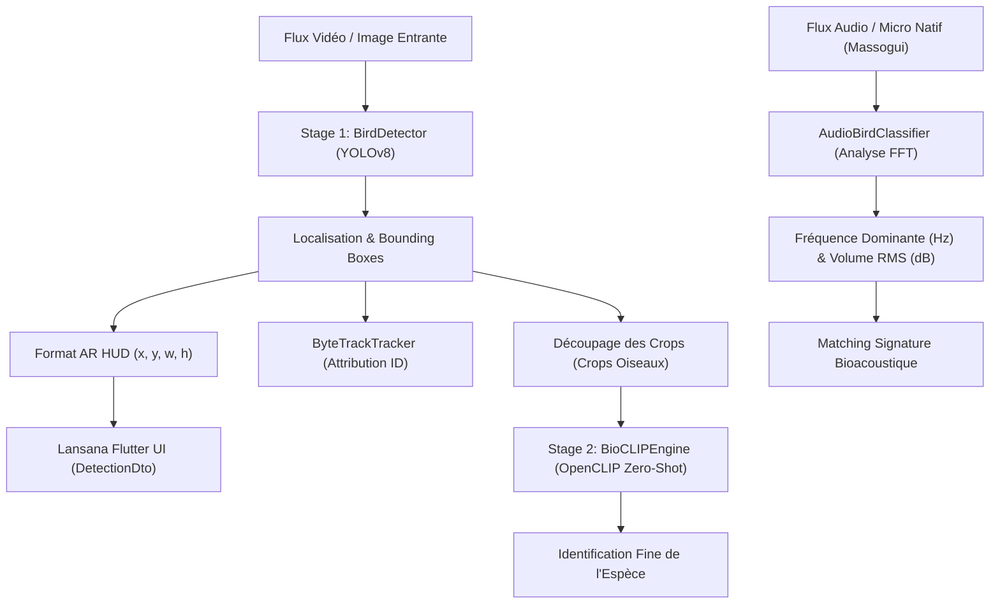

# 📐 Architecture du Unter-Système Computer Vision & Bioacoustique — BirdSense AI

Ce document décrit l'architecture logicielle, le pipeline multimodal à 2 étages, le traitement bioacoustique audio, le flux de données et les choix d'interfaçage du sous-système **Computer Vision & Multimodal** (Branche Git `Kalz` — Membre 4).

---

## 🏛️ 1. Architecture Globale

Le sous-système Computer Vision combine la détection générique d'objets en temps réel, le suivi multi-objets sur séquences vidéo, l'identification fine d'espèces d'oiseaux par modèle multimodal zéro-shot, et l'analyse spectrale FFT des chants d'oiseaux.

---

## 🔄 2. Pipeline Multimodal à 2 Étages

### Étage 1 : Détection Générique & Tracking (YOLOv8 + ByteTrack)
- **Rôle :** Localiser tous les oiseaux présents dans le cadre d'image ou le flux vidéo avec une grande vitesse d'exécution.
- **Modèle :** YOLOv8n fine-tuné / COCO classe 14 (`yolov8n.pt`).
- **Format HUD AR (T4.4) :** Conversion des coordonnées pixel en coordonnées normalisées $[0.0, 1.0]$ sous l'attribut `ar_hud_box: { "x": x, "y": y, "width": width, "height": height }` pour alimenter directement le painter `BoundingBoxPainter` du mobile.

### Étage 2 : Identification Zéro-Shot (OpenCLIP BioCLIP)
- **Rôle :** Identifier précisément l'espèce de l'oiseau à partir de la découpe (*crop*) de la bounding box.
- **Modèle :** OpenCLIP `ViT-B-32` (`laion2b_s34b_b79k`).
- **Fonctionnement :** Extraction de l'embedding d'image et comparaison par similarité cosinus avec la taxonomie des espèces cibles de la région.

---

## 🎵 3. Classification Bioacoustique Audio (T4.5)

- **Rôle :** Reconnaître l'espèce à partir du chant d'oiseau capturé par le microphone natif du téléphone.
- **Méthode :** Analyse spectrale FFT (*Fast Fourier Transform*), détection de la fréquence spectrale dominante (Hz) et du volume RMS (dB), couplée à une table de correspondance de signatures fréquentielles d'espèces régionales.
- **Gestion des Erreurs :** Levée d'une `ValueError` explicite sur fichier audio non décodable, retournée sous forme d'erreur **HTTP 400 Bad Request** par l'API REST FastAPI.

---

## ⚙️ 4. Infrastructures de Support

| Composant | Fichier Source | Rôle |
| :--- | :--- | :--- |
| **Configuration Centralisée** | [config.py](file:///c:/Users/Kalz/Documents/Serward%20Buspro/Team%20Projects/BirdSense/BirdSenseAI/src/vision/config.py) | Dataclass `VisionConfig` regroupant les poids, seuils, résolutions et taux d'échantillonnage. |
| **Logger Catégorisé** | [logger.py](file:///c:/Users/Kalz/Documents/Serward%20Buspro/Team%20Projects/BirdSense/BirdSenseAI/src/vision/logger.py) | Journalisation structurée avec tags `[VISION]`, `[YOLO]`, `[TRACKING]`, `[AUDIO]`, `[BIOCLIP]`, `[ONNX]`. |
| **Tracker de Métriques** | [performance.py](file:///c:/Users/Kalz/Documents/Serward%20Buspro/Team%20Projects/BirdSense/BirdSenseAI/src/vision/performance.py) | Chronométrage non-intrusif (ms), calcul du min/max/moyenne, FPS et export JSON. |
| **Point d'Entrée Démo** | [run_demo.py](file:///c:/Users/Kalz/Documents/Serward%20Buspro/Team%20Projects/BirdSense/BirdSenseAI/run_demo.py) | Script d'exécution unique générant les artéfacts dans `demo_output/`. |

---

## 📊 5. Modèle de Données REST API (`src/api/vision_router.py`)

### Exemples d'API Endpoints :
- `GET /api/v1/vision/health` : Statut du service Vision & Audio.
- `POST /api/v1/vision/detect` : Inférence pipeline 2-étages (YOLO + AR HUD Box + BioCLIP).
- `POST /api/v1/vision/track` : Suivi multi-objets vidéo ByteTrack.
- `POST /api/v1/vision/audio-classify` : Classification bioacoustique audio spectrale FFT (Retourne 400 si invalide).
